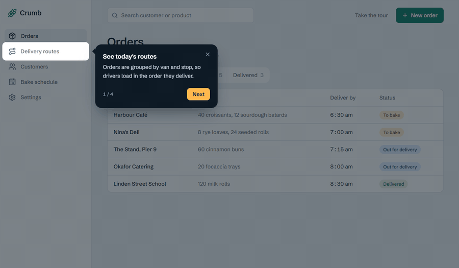

# radix-tour

An unstyled product tour library for React, built on [Radix](https://www.radix-ui.com/primitives) primitives and designed to be styled with Tailwind CSS.

Tours are built from small composable parts instead of a fixed tooltip. You write the card yourself, using your own components and classes, and the library handles the hard parts: finding the target, positioning the card, keeping it on screen, and cutting a spotlight around the element.



The tour above is the `Default` story in [`src/components/tour.stories.tsx`](./src/components/tour.stories.tsx).

## Features

- **Composable.** Every part accepts `asChild`, so you can render your own button, heading or card.
- **Unstyled.** The library ships no CSS. Style parts with `className` and `data-*` attributes.
- **Radix underneath.** Positioning, collision handling and portals come from `@radix-ui/react-popover`.
- **Waits for targets.** A step whose element is not on the page yet renders once it appears.
- **Per-step placement.** Each step chooses its own `side` and `align`.
- **Independent spotlight.** The overlay is a separate part. Leave it out to point at things without dimming the page.
- **Server Components ready.** The build keeps the `"use client"` directive.
- **Small.** About 6 kB gzipped to npm, with React and Radix as external dependencies.

## Installation

```bash
npm install radix-tour
```

`react` and `react-dom` (18 or 19) are peer dependencies.

## Quick start

```tsx
import * as React from "react";
import * as Tour from "radix-tour";

const steps: Tour.TourStep[] = [
  {
    id: "search",
    target: "#search",
    title: "Find an order fast",
    description: "Search by customer, product or order number.",
  },
  {
    id: "new-order",
    target: "#new-order",
    side: "bottom",
    align: "end",
    title: "Add an order",
    description: "Standing orders repeat every week.",
  },
];

export function OrdersTour() {
  const [open, setOpen] = React.useState(true);

  return (
    <Tour.Root steps={steps} open={open} onOpenChange={setOpen}>
      <Tour.Spotlight className="z-40 text-slate-900/55" />

      <Tour.Content className="z-50 w-80 rounded-2xl bg-slate-900 p-5 text-white">
        <Tour.Arrow className="fill-slate-900" />

        <Tour.Title className="font-semibold" />
        <Tour.Description className="mt-1 text-sm text-slate-300" />

        <div className="mt-4 flex items-center justify-between">
          <Tour.Progress className="text-xs text-slate-400" />

          <div className="flex gap-2">
            <Tour.Previous>Back</Tour.Previous>
            <Tour.Next>Next</Tour.Next>
          </div>
        </div>
      </Tour.Content>
    </Tour.Root>
  );
}
```

The `target` of each step is a CSS selector for an element in your page. The tour is controlled: you decide when `open` is true, and `onOpenChange(false)` is called when the user finishes or closes it.

## Anatomy

```tsx
<Tour.Root>
  <Tour.Spotlight />

  <Tour.Content>
    <Tour.Arrow />
    <Tour.Close />
    <Tour.Title />
    <Tour.Description />
    <Tour.Progress />
    <Tour.Previous />
    <Tour.Next />
  </Tour.Content>
</Tour.Root>
```

You can import the long names (`Tour`, `TourContent`, `TourSpotlight`, and so on) instead of using the namespace.

## Styling

Parts render plain elements, so style them with `className`. State is exposed through attributes:

| Part | Attributes |
| --- | --- |
| `Tour.Content` | `data-step` (zero-based index), `data-side`, `data-align`, `data-state` |
| `Tour.Spotlight` | `data-tour-spotlight` on the overlay, `data-tour-cutout` on the cut-out |

The spotlight is colored with `currentColor`, so a `text-*` class sets the overlay color and opacity.

### Animate the spotlight

The cut-out is an SVG rect, so you can make it glide between targets with CSS:

```css
@media (prefers-reduced-motion: no-preference) {
  [data-tour-cutout] {
    transition:
      x 360ms cubic-bezier(0.2, 0.8, 0.2, 1),
      y 360ms cubic-bezier(0.2, 0.8, 0.2, 1),
      width 360ms cubic-bezier(0.2, 0.8, 0.2, 1),
      height 360ms cubic-bezier(0.2, 0.8, 0.2, 1);
  }
}
```

### Label the last step

`useTour` reads the tour's state from inside `Tour.Root`:

```tsx
function NextButton() {
  const { isLast } = Tour.useTour();

  return <Tour.Next>{isLast ? "Done" : "Next"}</Tour.Next>;
}
```

## API reference

### `Tour.Root`

| Prop | Type | Description |
| --- | --- | --- |
| `steps` | `TourStep[]` | The steps, in order. |
| `open` | `boolean` | Whether the tour is showing. Opening always starts at the first step. |
| `onOpenChange` | `(open: boolean) => void` | Called with `false` when the last step is finished or the tour is closed. |

### `TourStep`

| Field | Type | Description |
| --- | --- | --- |
| `id` | `string` | Unique id for the step. |
| `target` | `string` | CSS selector of the element to point at. |
| `title` | `ReactNode` | Rendered by `Tour.Title` when it has no children. |
| `description` | `ReactNode` | Rendered by `Tour.Description` when it has no children. |
| `side` | `"top" \| "right" \| "bottom" \| "left"` | Side of the target the card sits on. Defaults to `"bottom"`. |
| `align` | `"start" \| "center" \| "end"` | Alignment along that side. Defaults to `"center"`. |

### Parts

| Part | Renders | Notes |
| --- | --- | --- |
| `Tour.Content` | Radix Popover content | Anchored to the current target. Accepts the Popover content props (`side`, `sideOffset`, `collisionPadding`, ...), which override the step's values. Renders nothing until the target exists. |
| `Tour.Arrow` | Radix Popover arrow | Place it inside `Tour.Content`. Fill it with a `fill-*` class. |
| `Tour.Spotlight` | `svg` | Props: `padding` (px around the target, default 8) and `radius` (corner radius, default 8). |
| `Tour.Title` | `h2` | Shows the step's `title` unless given children. |
| `Tour.Description` | `p` | Shows the step's `description` unless given children. |
| `Tour.Progress` | `span` | Shows `1 / 4` unless given children. |
| `Tour.Next` | `button` | Goes to the next step. On the last step, closes the tour. |
| `Tour.Previous` | `button` | Goes to the previous step. |
| `Tour.Close` | `button` | Closes the tour. |

Every part forwards its ref and accepts `asChild`. Event handlers run before the built-in behavior, and calling `event.preventDefault()` in `onClick` cancels it.

### `useTour()`

Returns `{ steps, step, index, isFirst, isLast, next, previous, close }`. It throws if called outside `Tour.Root`.

## Behavior

- The page stays interactive while the tour is open. Clicking outside the card does not close it.
- <kbd>Esc</kbd> closes the tour.
- Each step scrolls its target into view.
- The card is a Radix Popover, so it is exposed to assistive technology as a dialog. The spotlight is hidden from it.

## Server Components

The package starts with `"use client"`, so you can import it from a Server Component file. The tour itself must still render on the client.

## Development

```bash
npm install
npm run storybook     # stories at http://localhost:6006
npm test              # unit tests (Vitest + Testing Library)
npm run build         # ESM + CJS + type declarations in dist/
npm run check:fix     # lint, format and organize imports with Biome
```

To refresh the GIF at the top of this file after a visual change, start Storybook and run `node scripts/record-demo.mjs`. The header of that script lists what it needs.

The repository's conventions for components, tests and code style are in [AGENTS.md](./AGENTS.md).

## Roadmap

Planned before 1.0:

- A policy for steps whose target is missing or hidden (skip, wait or stop).
- Arrow-key navigation and focus return when the tour closes.
- Remembering which tours a user has seen.
- Router adapters for steps that span pages.

## License

[MIT](./LICENSE.md)
